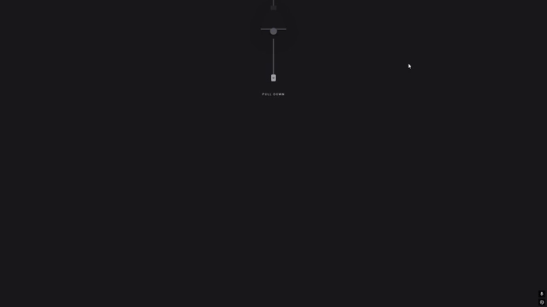

# Midnight Planner

Experiência interativa de autenticação construída com Next.js. Uma luminária com cordão substitui a tela inicial tradicional: ao puxar o cordão, a interface é revelada com animações, iluminação e transições suaves.

  

## Estado atual

O projeto está em desenvolvimento. A experiência visual e o cadastro de usuários estão implementados; login, sessão e área de produtividade ainda fazem parte do roadmap.

### Implementado

- interação de puxar o cordão da luminária;
- animações e transições com Framer Motion;
- formulário de cadastro e interface de login;
- endpoint para criação de usuários;
- validação de e-mail duplicado;
- hash de senha com bcrypt;
- persistência local com Prisma e SQLite.

### Planejado

- autenticação de login e gerenciamento de sessão;
- dashboard do usuário;
- gerenciamento de tarefas e anotações;
- salvamento automático;
- integração com calendário;
- testes automatizados.

## Tecnologias

| Camada | Tecnologias |
| --- | --- |
| Interface | Next.js 16, React 19, TypeScript, Tailwind CSS |
| Animações | Framer Motion |
| Backend | Next.js Route Handlers |
| Dados | Prisma ORM e SQLite |
| Segurança | bcryptjs para hash de senhas |

## Executando localmente

### Pré-requisitos

- Node.js 20 ou superior
- npm

### Instalação

~~~bash
git clone https://github.com/it0l/midnight-planner.git
cd midnight-planner
npm install
cp .env.example .env
npx prisma generate
npx prisma db push
npm run dev
~~~

No Windows PowerShell, use:

~~~powershell
Copy-Item .env.example .env
~~~

Abra [http://localhost:3000](http://localhost:3000).

## Estrutura principal

~~~text
app/
├── api/auth/register/route.ts
├── globals.css
├── layout.tsx
└── page.tsx
components/auth/
├── LampLogin.tsx
└── LoginForm.tsx
lib/
└── prisma.ts
prisma/
└── schema.prisma
~~~

## Observações de segurança

- Senhas são armazenadas como hash, nunca em texto puro.
- O banco SQLite é local e não deve ser versionado.
- Antes de disponibilizar o sistema publicamente, ainda são necessários sessão segura, rate limiting, validação mais rígida de entrada e proteção CSRF quando aplicável.

## Roadmap

- [x] Experiência interativa da luminária
- [x] Cadastro de usuário
- [x] Persistência local
- [ ] Login e sessão
- [ ] Dashboard
- [ ] Tarefas e anotações
- [ ] Testes automatizados
